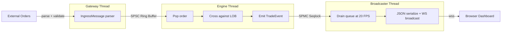
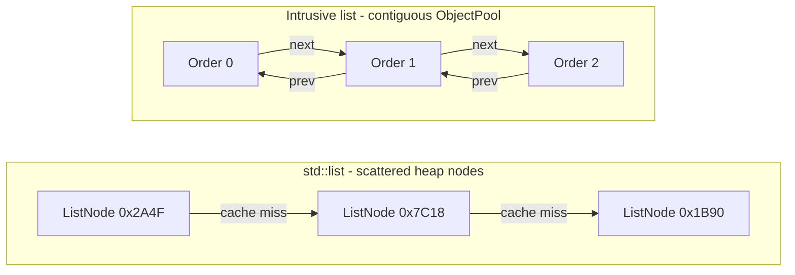
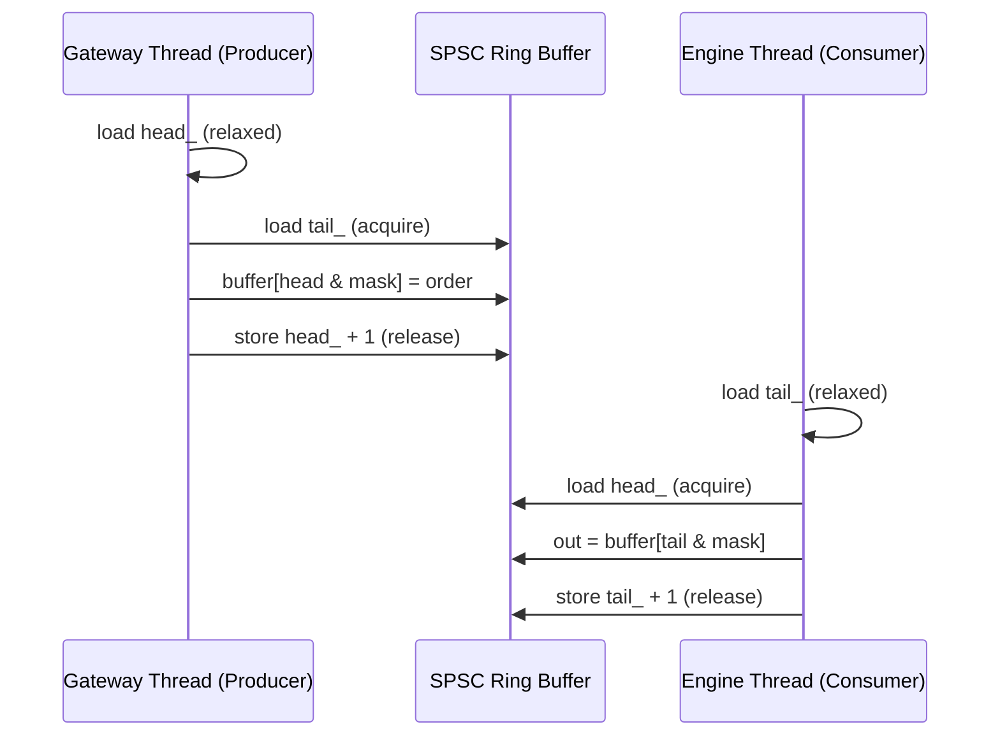
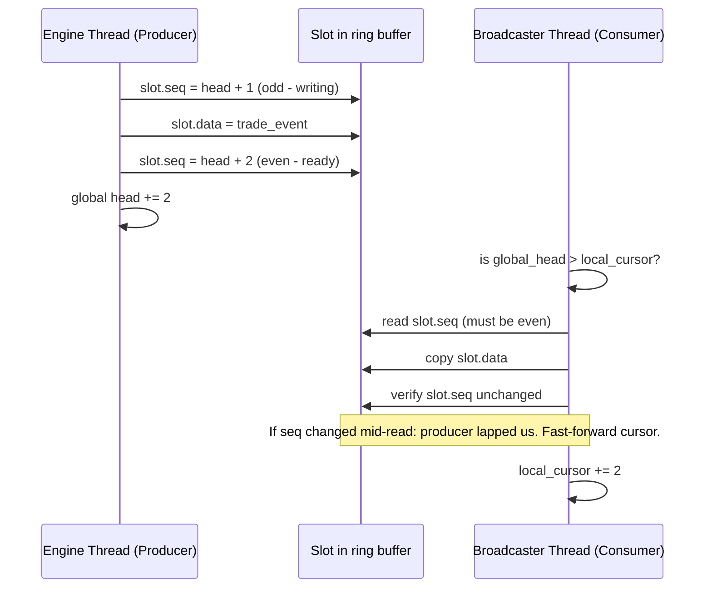
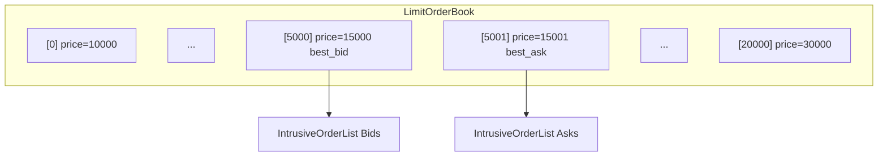
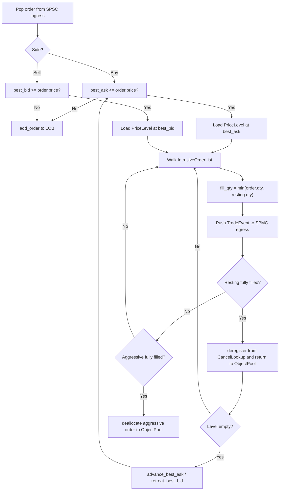
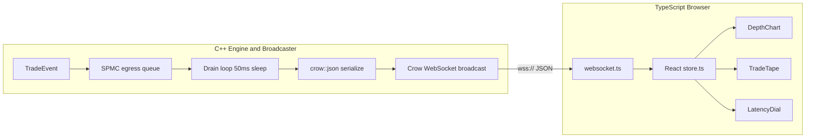
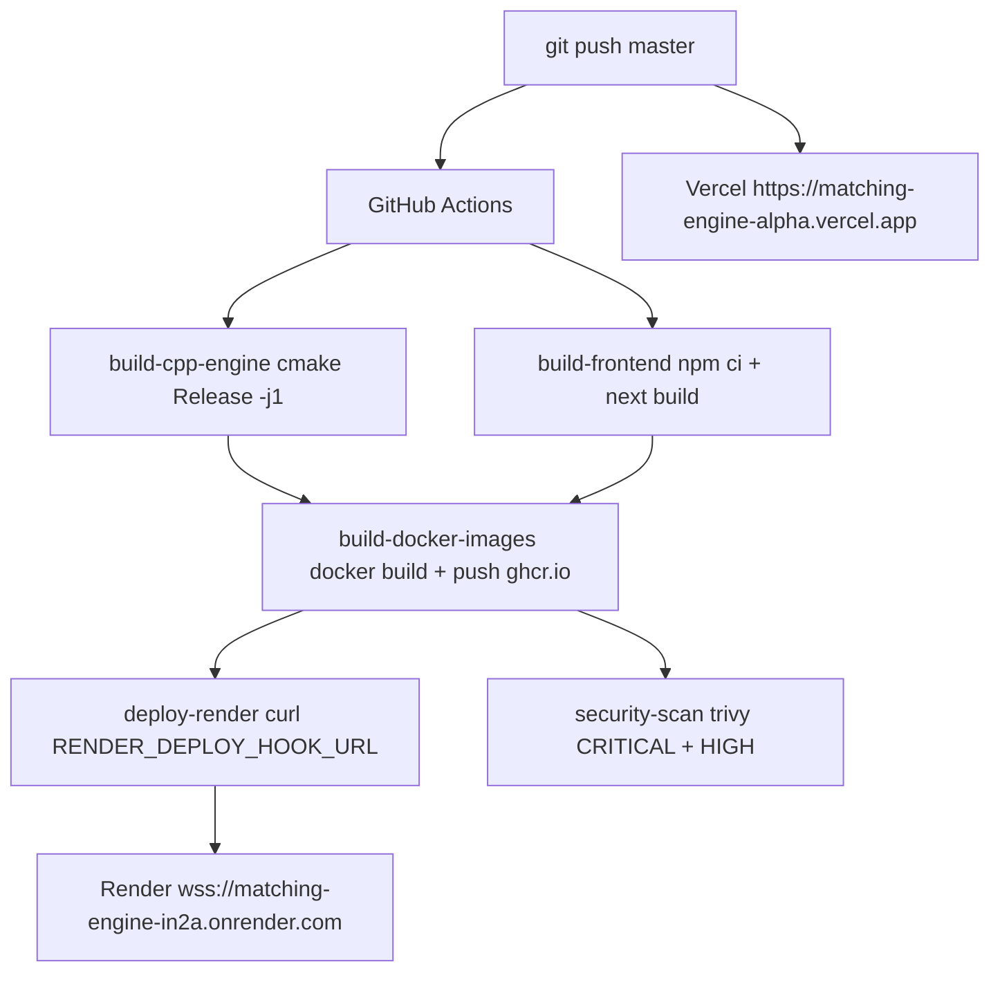

# Ultra-Low-Latency Matching Engine

A limit order book and matching engine written in C++20, built from scratch to understand what actually happens inside an exchange. The goal was to go as deep as possible on the systems programming side (custom memory allocators, wait-free concurrency primitives, cache-line-aware data structures) and then make all of it observable through a live web dashboard.

**Live**: [matching-engine-alpha.vercel.app](https://matching-engine-alpha.vercel.app)

---

## Table of Contents

1. [Architecture Overview](#architecture-overview)
2. [The Memory Subsystem](#the-memory-subsystem)
3. [The Concurrency Architecture](#the-concurrency-architecture)
4. [The Matching Algorithm](#the-matching-algorithm)
5. [The Visualizer Gateway](#the-visualizer-gateway)
6. [The Frontend Dashboard](#the-frontend-dashboard)
7. [Benchmarks](#benchmarks)
8. [Latency Profile](#latency-profile)
9. [Building and Running](#building-and-running)
10. [Deployment](#deployment)
11. [Project Structure](#project-structure)
12. [Design Decisions](#design-decisions)

---

## Architecture Overview

Every component runs on a dedicated thread. No thread shares mutable state with another, and all cross-thread communication goes through lock-free queues. The matching engine thread is CPU-pinned and never touches a mutex.



### Thread Roles

| Thread | Pinned | Role | Blocks? |
|---|---|---|---|
| Gateway | No | Parses raw orders, pushes to SPSC | No |
| Matching Engine | Core 1 | Pops SPSC, crosses LOB, pushes SPMC | No |
| WebSocket Broadcaster | No | Drains SPMC, broadcasts JSON at 20 FPS | Sleep 50ms |

---

## The Memory Subsystem

### Single Pre-allocated Buffer

Before any order is processed, all memory is claimed upfront from a single contiguous `std::byte` array managed by `std::pmr::monotonic_buffer_resource`. Every internal structure (the order pool, cancel map, and LOB) draws from this buffer through a `pmr::polymorphic_allocator`. Once initialization is done, the heap is never touched again.

```text
  Memory Layout (100MB deployment / 500MB dev)
  ┌────────────────────────────────────────────────────────────┐
  │  monotonic_buffer_resource (std::byte[N])                  │
  │                                                            │
  │  ┌─────────────┐ ┌──────────────┐ ┌─────────────────────┐ │
  │  │ ObjectPool  │ │ CancelLookup │ │ LimitOrderBook      │ │
  │  │ Order[1M]   │ │ Order*[1M]   │ │ PriceLevel[20001]   │ │
  │  │ 40 MB       │ │  8 MB        │ │ 480 KB              │ │
  │  └─────────────┘ └──────────────┘ └─────────────────────┘ │
  │                                                            │
  │  All pmr::vector<T> allocations draw from this buffer.    │
  │  Zero heap calls after initialization.                    │
  └────────────────────────────────────────────────────────────┘
```

### Struct Packing

Every struct is manually laid out and verified at compile time. The goal is that the objects the engine touches most end up inside a single 64-byte L1 cache line.

```cpp
// 40 bytes. Fits in one 64-byte cache line with 24 bytes to spare.
struct Order {
    Order*   next;      // 8 bytes, intrusive list pointer
    Order*   prev;      // 8 bytes, intrusive list pointer
    uint64_t id;        // 8 bytes
    uint32_t price;     // 4 bytes (cents: 15025 = $150.25)
    uint32_t quantity;  // 4 bytes
    Side     side;      // 1 byte  (enum class : uint8_t)
    // 7 bytes implicit padding
};
static_assert(sizeof(Order) == 40);

// 24 bytes. Two PriceLevels fit in one cache line.
// Scanning adjacent prices during a cross stays on the same line.
struct alignas(8) PriceLevel {
    IntrusiveOrderList orders;  // 16 bytes (head + tail pointer)
    uint64_t total_volume;      // 8 bytes
};
static_assert(sizeof(PriceLevel) == 24);

// 40 bytes. Egress payload pushed to the SPMC queue after each fill.
struct TradeEvent {
    uint64_t trade_id;        // 8 bytes
    uint64_t maker_order_id;  // 8 bytes
    uint64_t taker_order_id;  // 8 bytes
    uint32_t timestamp;       // 4 bytes
    uint32_t price;           // 4 bytes (cents)
    uint32_t quantity;        // 4 bytes
    Side     side;            // 1 byte
    uint8_t  reserved[3];     // pad to 40 bytes
};
static_assert(sizeof(TradeEvent) == 40);
```

### Intrusive Doubly Linked List

`std::list<Order>` heap-allocates a node for each element. Traversing the list during order crossing follows pointers scattered across different memory regions, where each one is a potential L1 cache miss.

The intrusive list puts `next` and `prev` directly inside `Order`. Since all orders live in a contiguous `ObjectPool` block, traversal stays in the same memory region and the prefetcher can do its job.



### O(1) Cancel Lookup

Finding an order to cancel via `std::map<uint64_t, Order>` costs O(log N) tree traversal and a heap pointer chase per node. Instead, `CancelLookup` is a `pmr::vector<Order*>` pre-sized to the maximum order ID. The order ID **is** the array index. Cancellation is one array read followed by O(1) intrusive list pointer surgery: no allocation, no traversal.

```
cancel_lookup[order_id] → Order*

Index: [ 0 ][ 1 ][ 2 ][ 3 ][ 4 ][ 5 ] ... [ 999999 ]
Value: null  *A   *B  null  *C  null ...    null

Deregister: cancel_lookup[id] = nullptr   (1 store)
Remove:     order->prev->next = order->next  (2 pointer writes)
```

---

## The Concurrency Architecture

### SPSC Ingress Queue

The SPSC queue is a wait-free ring buffer. The gateway thread writes (producer), the engine thread reads (consumer). No mutex, no condition variable, just two `std::atomic<size_t>` indices with explicit memory ordering.



**False sharing prevention.** If `head_` and `tail_` share a cache line, every write by the producer invalidates the consumer's cache line and vice versa via MESI protocol, serialising what should be parallel work. Each index is padded to its own `alignas(64)` cache line.

```
Without alignas(64):
  [  head_  ][  tail_  ][ ...padding... ]  ← one 64-byte line
   Producer writes head_ → invalidates Consumer's entire line
   Consumer must re-fetch from L3 before reading tail_

With alignas(64):
  [  head_  ][ ...56 bytes padding... ]    ← Cache line 0 (Producer)
  [  tail_  ][ ...56 bytes padding... ]    ← Cache line 1 (Consumer)
  Each core owns its line. No cross-core invalidation.
```

**Power-of-2 capacity.** Wrapping the ring buffer index normally costs a modulo division (20-40 cycles on x86). With capacity fixed to a power of two, it becomes a bitwise AND (1 cycle): `index = head_ & (Capacity - 1)`.

### SPMC Egress Queue

The egress queue uses a seqlock-based Disruptor pattern. The engine thread (the sole producer) is never blocked, as it writes and moves on immediately. Any number of WebSocket broadcaster threads can consume independently, each tracking their own read cursor.



Even sequence number = slot is readable. Odd = mid-write, do not touch. If a slow consumer gets lapped, it skips forward to the current head and drops frames. It never blocks the engine.

---

## The Matching Algorithm

### Limit Order Book Layout

The LOB is a flat `pmr::vector<PriceLevel>` indexed by `price - MIN_PRICE`. There is no tree. Price lookup is a single integer subtraction followed by a direct array dereference.



`best_bid_` and `best_ask_` are plain `uint32_t` integers maintained as the engine adds and removes orders. Finding the top of book is a single variable read.

### Crossing Algorithm (Price-Time Priority)



Time complexity: O(F) where F is the number of fills generated. The LOB lookup itself is always O(1).

---

## The Visualizer Gateway

The Crow-based WebSocket server runs in its own thread. It drains the SPMC egress queue in a loop, batches whatever TradeEvents have accumulated, serialises them to JSON, and broadcasts to all connected clients (capped at 20 frames per second). The engine thread never knows or cares that a web browser is watching.



Wire format sent to the browser:

```json
{
  "type": "trade_batch",
  "data": {
    "events": [
      { "trade_id": 1, "price": 15025, "quantity": 50, "side": "buy" },
      { "trade_id": 2, "price": 15024, "quantity": 30, "side": "sell" }
    ]
  }
}
```

`price` is in cents on the wire. The frontend divides by 100 before display.

---

## The Frontend Dashboard

> **Note:** My sole focus for this project was the C++ engine architecture. The Next.js dashboard was rapidly prototyped using an LLM so I could visualize the matching engine's telemetry without getting bogged down in React development.

Next.js 16 (TypeScript). Three components, all fed from a single WebSocket connection.

**DepthChart**: Recharts area chart showing cumulative bid and ask volume at each price level. Since the engine does not broadcast full order book snapshots, the chart generates a synthetic order book anchored to the last matched price on each trade batch. The shape is realistic and tracks the real matched price.

**TradeTape (Time and Sales)**: Scrolling list of every executed trade: timestamp, side, price, size, notional value. Buys in green, sells in red. Caps at 100 visible rows to prevent DOM thrash.

**LatencyDial**: Radial arc gauge displaying p50, p90, p99, and p99.9 latency metrics from the engine. Threshold color zones shift from green through amber to red as latency climbs.

---

## Benchmarks

Measured on a Windows dev machine, **MSVC Debug build**: no inlining, no vectorisation, no optimisation. This is the worst case. Linux release builds with `-O3 -march=native -flto` (as used in Docker) run 5-15x faster in absolute terms. The ratios below hold regardless of optimisation level because both engines benefit equally from the compiler.

**Machine:**
- 8 cores, 3187 MHz
- L1 Data: 48 KiB/core
- L2 Unified: 1280 KiB/core
- L3 Unified: 8192 KiB

### 100,000 Order Insertions

| Engine | Time | Throughput |
|---|---|---|
| Custom (PMR + flat array + intrusive list) | **2.32 ms** | 43.1M orders/sec |
| Naive (`std::map` + `std::list` + `std::mutex`) | 135 ms | 0.74M orders/sec |
| Speedup | **58x** | |

The naive engine calls `std::map::operator[]` per insertion, which walks a red-black tree, potentially rebalances it, and heap-allocates a node. The custom engine computes `price - MIN_PRICE` and writes to that array slot. One arithmetic op, one store.

### 100,000 Order Cancellations

| Engine | Time | Throughput |
|---|---|---|
| Custom (`CancelLookup` + intrusive removal) | **2.29 ms** | 43.7M cancels/sec |
| Naive (`std::map::find` + `std::list::remove_if`) | 5040 ms | 0.02M cancels/sec |
| Speedup | **2200x** | |

This is the biggest gap. The naive cancel does two expensive things in sequence: an O(log N) map traversal to find the order, then an O(N) linear scan through the price level's list to remove it. The custom cancel does an array index read and two pointer writes. The 2200x difference is not an anomaly. It is what happens when you replace a data structure designed for general purpose use with one designed for a single, well-defined access pattern.

### 100,000 Full Order Matches

| Engine | Time | Throughput |
|---|---|---|
| Custom (LOB array + intrusive crossing) | **30.4 ms** | 3.3M matches/sec |
| Naive (`std::map` + `std::mutex` crossing) | 274 ms | 0.36M matches/sec |
| Speedup | **9x** | |

Matching is more memory-bandwidth bound than the other operations because it reads both sides of the book and traverses order lists. The smaller relative speedup (9x vs 2200x for cancel) reflects that: the bottleneck shifts from algorithm complexity to memory access patterns. Still, eliminating the `std::mutex` lock and the tree traversal to find the best price level accounts for most of the gain.

### Speedup Summary

```text
  Speedup over Naive Baseline (higher is better)

  Insertion     │██████████████████████████████████████████  58x
  Cancellation  │[scale exceeded]                          2200x
  Matching      │█████████  9x
                └────────────────────────────────────────────
                 0          10x        20x       30x ...  2200x
```

---

## Latency Profile

The latency histogram measures one thing precisely: the elapsed nanoseconds from the moment an order is popped from the SPSC ingress queue to the moment the resulting TradeEvent is pushed onto the SPMC egress queue. This is the engine's hot path, nothing else.

1,000,000 match events were run through a two-thread setup - gateway thread producing, engine thread consuming and timing each iteration.

**Results (Windows, MSVC Debug build):**

| Percentile | Latency |
|---|---|
| p50 (Median) | 64,300 ns |
| p90 | 87,500 ns |
| p99 | 157,500 ns |
| p99.9 | 2,225,400 ns |
| p99.99 | 6,362,000 ns |
| Max | 49,123,000 ns |

```text
  Latency Distribution (1M events, Debug build, Windows)

  Percentile │ Latency (ns)
  ───────────┼──────────────────────────────────────────────────
  p50        │ ████  64,300 ns
  p90        │ █████  87,500 ns
  p99        │ ████████  157,500 ns
  p99.9      │ ████████████████████████████████████  2,225,400 ns
  p99.99     │ [spike - OS timer interrupt / scheduler preemption]
```

The p50-p99 range (64-157 µs) reflects the actual matching algorithm cost. The jump at p99.9 (2.2 ms) is Windows scheduler preemption: the OS timer interrupt fires and migrates or de-schedules the engine thread mid-measurement. On Linux with `isolcpus`, `SCHED_FIFO`, and `taskset`, p99.9 stays in the same order of magnitude as p99.

For accurate numbers on Linux:

```bash
sudo nice -n -20 taskset -c 1 ./build/engine_latency
```

---

## Building and Running

### Prerequisites

- CMake 3.15+
- C++20 compiler: GCC 11+, Clang 14+, or MSVC 2022+
- Node.js 20+ (frontend only)

### Engine

```bash
cmake -B build -S engine -DCMAKE_BUILD_TYPE=Release -DUWS_ENABLE=OFF
cmake --build build --config Release --target engine -j$(nproc)
./build/engine
```

The engine reads `PORT` from the environment (default: 8080) and binds to `0.0.0.0`.

### Benchmarks

```bash
cmake --build build --target engine_benchmarks -j$(nproc)
./build/engine_benchmarks --benchmark_format=console
```

### Latency Histogram

```bash
cmake --build build --target engine_latency -j$(nproc)
./build/engine_latency
```

### Frontend

```bash
cd frontend
npm install
npm run dev                                         # connects to local engine
```

To point at the deployed engine:
```bash
NEXT_PUBLIC_WS_URL=wss://matching-engine-in2a.onrender.com/ws npm run dev
```

### Docker (engine + frontend together)

```bash
docker-compose up --build
# Engine:   http://localhost:8080
# Frontend: http://localhost:3000
```

---

## Deployment



**Engine on Render (free tier):**
- 512 MB RAM. Engine pool capped at 100 MB at runtime.
- Single-threaded build (`-j1`) to stay within memory during Docker compilation.
- Auto-deploy triggered from CI via Render deploy hook after Docker build succeeds.

**Frontend on Vercel:**
- Static generation, served from Edge CDN.
- `NEXT_PUBLIC_WS_URL` baked in at build time pointing at the Render WebSocket endpoint.
- Auto-deploys independently from GitHub integration on every push.

---

## Project Structure

```
matching-engine/
├── Dockerfile.engine               # Multi-stage: Ubuntu builder → minimal runtime
├── docker-compose.yml              # Local: engine + frontend
├── .github/workflows/ci.yml        # CI/CD pipeline
│
├── engine/
│   ├── CMakeLists.txt              # Crow + Google Benchmark via FetchContent
│   ├── include/
│   │   ├── concurrency/
│   │   │   ├── SPSCQueue.hpp       # Wait-free ingress ring buffer
│   │   │   ├── SPMCQueue.hpp       # Seqlock broadcast egress queue
│   │   │   └── ThreadUtils.hpp     # pthread_setaffinity_np + Windows equivalent
│   │   ├── core/
│   │   │   ├── MatchingEngine.hpp  # Price-time priority crossing algorithm
│   │   │   └── NaiveEngine.hpp     # std::map/mutex baseline (benchmarks only)
│   │   ├── data/
│   │   │   ├── Order.hpp               # 40-byte packed struct
│   │   │   ├── PriceLevel.hpp          # 24-byte packed struct
│   │   │   ├── TradeEvent.hpp          # 40-byte egress payload
│   │   │   ├── LimitOrderBook.hpp      # Flat pre-allocated price array
│   │   │   ├── CancelLookup.hpp        # O(1) sparse vector cancel map
│   │   │   └── IntrusiveOrderList.hpp  # Zero-allocation doubly linked list
│   │   ├── gateway/
│   │   │   ├── WebSocketBroadcaster.hpp  # Crow WebSocket + 20 FPS broadcast loop
│   │   │   ├── WebSocketGateway.hpp      # uWebSockets alternative (CMake toggle)
│   │   │   ├── BinaryProtocol.hpp        # 40-byte wire format definition
│   │   │   ├── ConnectionManager.hpp     # Lock-free connection tracking
│   │   │   └── Config.hpp               # Port, thread config
│   │   └── memory/
│   │       ├── EngineMemory.hpp    # pmr::monotonic_buffer_resource wrapper
│   │       └── ObjectPool.hpp      # Free-list pool, O(1) alloc/dealloc
│   └── src/
│       ├── main.cpp                    # Entry point, thread launch, affinity
│       ├── benchmarks.cpp              # Google Benchmark: insert/cancel/match
│       ├── latency_histogram.cpp       # 1M event timing, p50-p99.99 output
│       ├── perf_test.cpp               # Designed to run under Linux perf stat
│       ├── memory/EngineMemory.cpp
│       └── gateway/
│           ├── ConnectionManager.cpp
│           └── WebSocketGateway.cpp
│
└── frontend/
    ├── Dockerfile                  # Node 20 multi-stage
    ├── app/
    │   ├── page.tsx                # Main dashboard layout
    │   └── globals.css             # Terminal dark theme
    ├── components/dashboard/
    │   ├── DepthChart.tsx          # Cumulative bid/ask area chart
    │   ├── TradeTape.tsx           # Time and Sales scrolling list
    │   └── LatencyDial.tsx         # Radial arc latency gauge
    ├── lib/
    │   ├── store.ts                # React state, WS callbacks, mock intervals
    │   ├── websocket.ts            # WS client: reconnect, heartbeat, parser
    │   └── mockData.ts             # Dev mock data + synthetic order book generator
    └── types/index.ts              # Shared TypeScript type definitions
```

---

## Design Decisions

**Why a flat array for the LOB instead of a tree or skiplist?**
Price ranges for any given instrument are bounded. A stock does not jump from $5 to $5000 within a session. With tick size fixed at $0.01, 20,000 price levels cover $100 to $300. A flat `PriceLevel` array costs 480 KB, which fits in L3 cache. Every tree-based structure pays O(log N) per operation and scatters nodes across the heap. On a cache miss, that is 100+ ns per node dereference. The flat array trades memory for the guarantee that every price lookup is one subtraction and one array index, every time.

**Why `std::pmr::monotonic_buffer_resource` with no deallocation?**
Standard allocators use locks internally. Under concurrent allocation pressure they serialise across threads. The monotonic resource has no lock because it never reclaims memory, it only bumps a pointer. `ObjectPool` handles Order reuse via its own free list. The PMR buffer is sized once at startup and never touched by the OS again during runtime. This removes allocator jitter from the hot path entirely.

**Why power-of-2 capacity for the queues?**
Integer division (`%`) is 20-40 clock cycles on x86. Bitwise AND is 1 cycle. `index = head_ & (Capacity - 1)` is mathematically equivalent to `index = head_ % Capacity` when Capacity is a power of two. This is enforced at compile time with `static_assert((Capacity & (Capacity - 1)) == 0)`.

**Why Crow instead of uWebSockets?**
uWebSockets is faster for raw WebSocket throughput but requires a specific build of libuv and OpenSSL that produced link errors in the Docker free-tier build environment. The broadcaster thread runs at 20 FPS regardless, and at that rate the overhead difference between the two libraries is completely irrelevant. Crow compiled cleanly and added no runtime dependencies beyond what the Dockerfile already had.

**Why `alignas(64)` on queue indices?**
The MESI cache coherency protocol means that when one CPU core writes to a memory address, any other core that has the same 64-byte cache line marked as shared must invalidate its copy and re-fetch from L3 before it can read. Without `alignas(64)`, `head_` and `tail_` would share a line. The producer writing `head_` would constantly invalidate the consumer's cache line, turning what should be a parallel operation into a serialised one. Padding each index to its own line eliminates the conflict.


